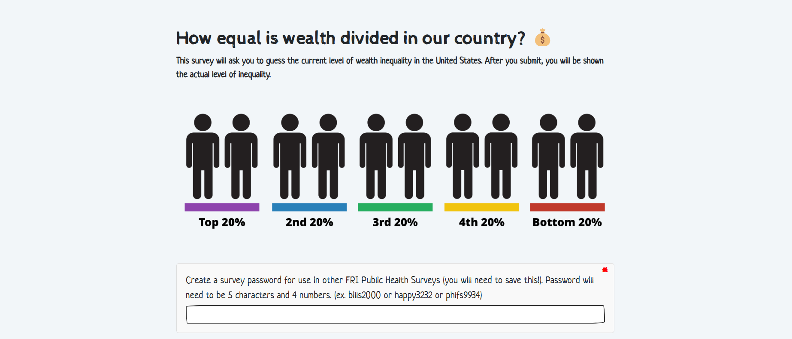

## Inequality Perceptions App

### Purpose

The purpose of this app is to ask users how they believe wealth is divided in the United States, and then give a graphical representation of their guesses.

After submitting their demographic information, participants will assign a percentage of total wealth to five buckets (Bottom 20% to Top 20%) for their expectations and ideals.

## Shiny Interface

Use the app [here](https://zachspiegel.shinyapps.io/Inequality/).

## Project Files

-   survey.qmd: Builds the user interface for the survey

<!-- -->

-   app.R: Contains the code that renders app

## Authors & Citation

This R shiny app was developed in the Public Health stream of the First-Year Research Immersion (FRI) program at Binghamton University.

Conceptualization: Zach Spiegel, Shane McCarty

Data Curation: Zach Spiegel

Formal Analysis: Zach Spiegel

Funding: Shane McCarty, Binghamton FRI Program

Investigation: Zach Spiegel, Shane McCarty

Methodology: Zach Spiegel, Shane McCarty

Project Administration: Zach Spiegel

Software: Zach Spiegel

Resources: Shane McCarty

Supervision: Shane McCarty

Validation: Zach Spiegel

Visualization: Zach Spiegel

Writing: Zach Spiegel

Zach Spiegel and Shane McCarty, PhD

Spiegel, Z. & McCarty S. [Inequality Perceptions]{.underline} \[Shiny web application\]. Retrieved from: <https://zachspiegel.shinyapps.io/Inequality/>
